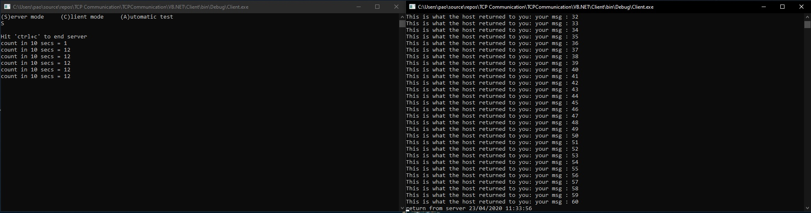

# TCPCommunication
This is a demo project, both c# and VB.NET, to implement one communication between front-end application and Service application created by [Mehdi Gholam](https://www.codeproject.com/Articles/156765/WCF-Killer) in C# and ported by Omar Pasini to VB:NET

#Screenshot

